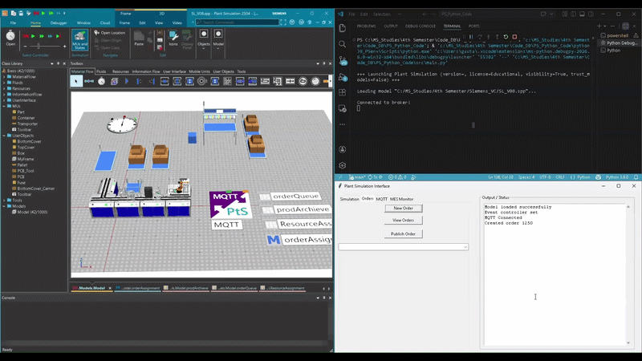

# Towards Plant-Level Virtual Acceptance Testing (VAT)

This repository contains the implementation and research work focused on integrating a simulation model with a Manufacturing Execution System (MES4) to support plant-level Virtual Acceptance Testing (VAT).

The project is based on the **AAU 5G Smart Production Lab FESTO Assembly Line** and uses **Siemens Tecnomatix Plant Simulation** to create a virtual representation of the physical manufacturing system.

The implementation is divided into multiple phases, starting from the development of a standalone simulation model and extending toward MES communication and bidirectional synchronization.



---

# Project Overview

The project focuses on:

- Development of a simulation model of the FESTO assembly line
- Simulation workflow validation
- SimTalk-based control logic
- Integration between Plant Simulation and MES4
- MQTT-based communication architecture
- Virtual validation of manufacturing workflows

The overall goal is to create a foundation for:

- Digital Twin development
- MES-level validation
- Virtual commissioning
- Plant-level Virtual Acceptance Testing (VAT)

---

# Repository Structure

```bash
├── README.md
├── docs/
│   ├── simulation_setup_README.md
│   ├── phase1_README.md
│   └── phase2_README.md
├── GitHub_media/
├── PlantSim_Files/
├── python38_PSenv/
├── src/
├── requirements.txt
└── mes4.log

```
# Running the Script
>[!NOTE]
> Access the `src\main.py` file to execute the program.


# Python Environment Setup

To establish communication between external Python applications and Siemens Plant Simulation, the following setup is required.

## Required Python Version

```text
Python 3.8 or lower
```

Current project environment is based on **Python 3.8**.

---

## Create Virtual Environment

```bash
py -3.8 -m venv plantsim_env
```

Activate the environment:

```bash
plantsim_env\\Scripts\\activate
```

---

# Required Python Libraries

The following libraries are used in the virtual environment for communication between Python, MES4, MQTT, and Plant Simulation.

| Package | Version |
|---|---|
| et-xmlfile | 2.0.0 |
| mqtt | 0.0.1 |
| numpy | 1.24.4 |
| openpyxl | 3.1.5 |
| paho-mqtt | 1.6.1 |
| pandas | 2.0.3 |
| plantsim | 0.0.3 |
| pywin32 | 225 |
| python-dateutil | 2.9.0.post0 |
| pytz | 2025.1 |
| setuptools | 41.2.0 |
| six | 1.17.0 |
| texttable | 1.7.0 |
| tzdata | 2025.2 |

---

## Install All Dependencies

```bash
pip install -r requirements.txt
```

>[!NOTE]
> The `requirements.txt` file contains all required libraries for running the scripts inside the `/src` folder.

---

## Important Dependency

>[!IMPORTANT]
> `pywin32==225` is required for communication between Python and Siemens Plant Simulation.

## Fix DLL Import Issue

If you encounter:

```text
ImportError: DLL load failed
```

Copy the DLL from:

```text
<venv>\\Lib\\site-packages\\pywin32_system32
```

to:

```text
<venv>\\Lib\\site-packages\\win32
```

---

# MES4 Connection Overview

MES4 communication is established using a **TCP/IP Request-Response** architecture.

The implementation uses:

- Service calls
- String encoding
- TCP/IP socket communication

---

# MES4 Services Used

| Service | Purpose |
|---|---|
| GetFirstOpForRsc | Retrieve first operation |
| GetOpForONoOPos | Retrieve order details |
| OpStart | Start operation |
| OpEnd | End operation |

---

# Example MES4 Request Format

```text
444;RequestID=1;MClass=100;MNo=4;#ResourceID=1
```

---

# Software/Tools Used

| Software/Tools | Purpose |
|---|---|
| Siemens Plant Simulation | Simulation Environment |
| SimTalk | Simulation Logic |
| Python | External Interface |
| MQTT | Communication Protocol |
| TCP/IP | MES Communication |
| MES4 | Manufacturing Execution System |

---

# Implementation

## Simulation Setup 

This section explains how the simulation model of the FESTO assembly line was created using Siemens Tecnomatix Plant Simulation.

- CAD model preparation
- Simulation object creation
- Material flow setup
- SimTalk logic implementation
- Workflow validation

[Simulation Setup Implementation](docs/simulation_setup_README.md)

---

## Phase 1 — One-Way Communication

This phase demonstrates the implementation of one-way communication between the MES4 system and the simulation model.

Main focus areas:

- TCP/IP communication
- MQTT publishing
- Data transfer from MES to simulation
- Message interpretation inside Plant Simulation

[Phase 1 Implementation](docs/phase1_README.md)

---

## Phase 2 — Two-Way Communication

This phase demonstrates bidirectional communication between the simulation environment and the MES4 system.

Main focus areas:

- Two-way MQTT communication
- Request-response workflow
- Simulation feedback to MES
- Synchronization between virtual and physical systems

[Phase 2 Implementation](docs/phase2_README.md)

---

# Project Outcome & Value

This project demonstrates the feasibility of integrating a existing Manufacturing Execution System (MES4) with a digital simulation model to support the development of a Digital Twin (DT) and initiate plant-level Virtual Acceptance Testing (VAT).

The implementation extends traditional virtual validation beyond machine and control levels toward the plant level of the ISA-95 automation hierarchy.

---

# Limitations & Practical Challenges

Although the implementation successfully demonstrates MES-Digital Twin integration and plant-level virtual validation, several limitations were identified during development.

These limitations reflect the practical challenges of integrating legacy manufacturing systems into modern Industry 4.0 architectures.

---

## MES Communication Stability

The MES4 system becomes unstable when processing multiple concurrent incoming messages from external systems.

This creates challenges when:

- Multiple service calls are executed simultaneously
- Large amounts of data are exchanged
- Continuous synchronization is required

---

## Communication Latency

The current implementation uses two communication protocols in the MES layer:

- TCP/IP communication with MES4
- MQTT communication with the simulation model

The coexistence of these protocols introduces:

- Communication latency
- Synchronization delays
- Slower response times during high message exchange

---

## Limited Error Handling

The current Digital Twin implementation does not fully support advanced error handling and recovery mechanisms.

For example:

- If the simulation encounters unexpected conditions or infinite loops, the simulation may reset
- The MES order may remain in the last processing state
- Synchronization inconsistencies can occur between MES and the simulation model

---

## JSON Parsing Limitation in Plant Simulation

A limitation was identified in the MQTT interface of Plant Simulation related to JSON list parsing.

To overcome this limitation:

- Incoming data is converted into strings
- Parsed manually into lists
- Reconstructed into JSON format

This workaround introduces inefficiencies when processing larger datasets.

---

## Partial Digital Twin Realization

Although bidirectional communication and synchronization were achieved, the implementation should be considered a foundational Digital Twin prototype rather than a fully complete Digital Twin.

Current limitations include:

- Partial MES functionality support
- Limited synchronization capabilities
- No advanced fault recovery
- Limited handling of complex production scenarios

---

## Limited Validation Scope

The current implementation mainly focuses on:

- Order scheduling
- Resource operations
- Resource state monitoring

---

## Brownfield Integration Challenges

The project demonstrates the practical difficulty of retrofitting legacy manufacturing systems into modern Digital Twin architectures.

The limitations mainly originate from:

- Legacy MES communication interfaces
- Compatibility constraints
- Existing infrastructure limitations
- Communication synchronization complexity

---

# Value Provided by the Project

The project provides value in several areas of digital manufacturing and Industry 4.0 development.

## Plant-Level Validation

The implementation demonstrates that MES-driven production behavior can be evaluated in a virtual environment, extending validation beyond traditional machine-level Virtual Commissioning approaches.

---

## Digital Twin Foundation

The project establishes a foundational Digital Twin architecture capable of:

- Real-time synchronization
- MES interaction
- Dynamic workflow execution
- Event-driven communication

---

## Industry 4.0 Integration

The use of:

- MQTT communication
- Simulation-driven workflows
- External MES interaction
- Bidirectional communication

aligns the implementation with Industry 4.0 manufacturing principles.

---

## Reusable & Scalable Architecture

The developed methodology and simulation models provide a reusable foundation for:

- Future Digital Twin development
- Advanced MES integration
- Plant-level VAT research
- Scalable manufacturing architectures

---

# Research Contribution

This project contributes toward addressing the research gap in plant-level virtual validation by extending MES integration into simulation-driven validation workflows.

The implementation demonstrates the feasibility of retrofitting existing manufacturing systems with Digital Twin concepts while highlighting practical challenges associated with brownfield integration.

---

# Acknowledgement

I would like to express my sincere gratitude to everyone who contributed to and supported this project.

Special thanks to:

- **Aalborg University (AAU)** and the **AAU 5G Smart Production Lab** for providing the research environment and access to the FESTO assembly line used as the reference system for this implementation.

- My supervisors, Lab's staff scientist and colleagues for their guidance, technical discussions, and valuable feedback throughout the project.

This project was developed as part of research focused on:

- Digital Twin development
- MES integration
- Plant-level Virtual Acceptance Testing (VAT)
- Industry 4.0 manufacturing systems

The experience gained throughout this work contributed significantly to understanding:

- Manufacturing system integration
- Simulation-driven validation
- Industrial communication architectures
- Practical challenges of Digital Twin implementation in brownfield environments