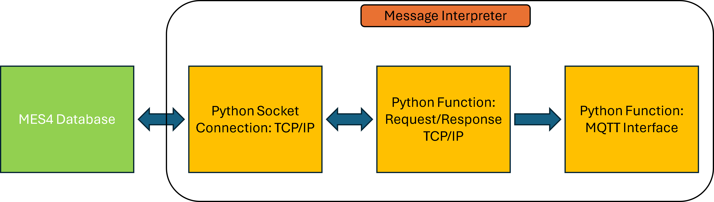
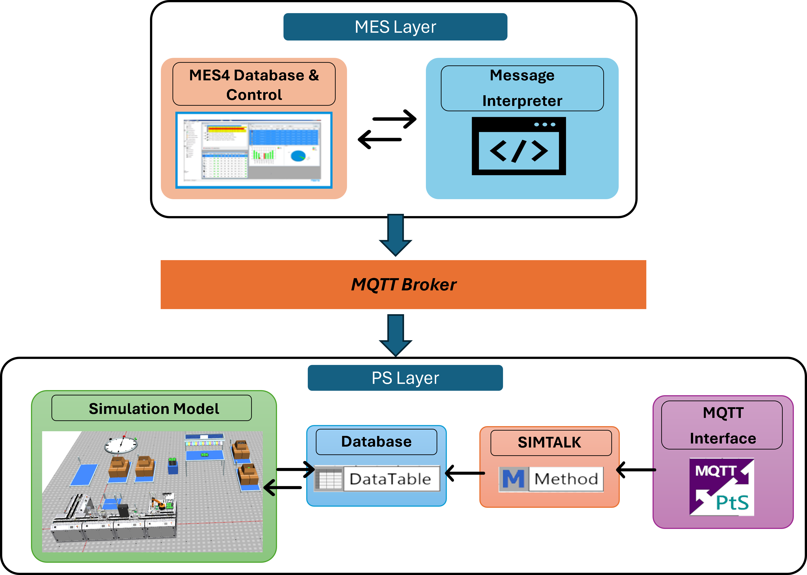

# Phase 1 — One-Way Communication Implementation

Phase 1 focuses on establishing the initial communication between the MES4 system and Siemens Plant Simulation (PS).

The objective of this phase is to enable the simulation model to receive production order data from MES4 and execute the simulation workflow based on external MES information.

---

# Phase 1 Architecture

The implementation is divided into two main layers:

```text
MES4 Layer
     ↓
Plant Simulation Layer
```

---

# MES Layer Implementation

The MES layer is responsible for collecting production data from MES4 and forwarding it to the simulation environment.

---

## TCP/IP Communication

MES4 communication is established using a TCP/IP socket connection.

The implementation uses predefined MES4 services to retrieve production order information.

The main service used in this phase is:

| Service | Purpose |
|---|---|
| GetFirstOpForRsc | Retrieves the first operation of scheduled orders |

---

## Message Interpreter

A custom message interpreter is developed using Python.

The interpreter performs the following tasks:

- Establish TCP/IP communication with MES4
- Send service requests
- Receive MES responses
- Convert MES data into JSON format
- Publish the data through MQTT


---

# MQTT Communication

MQTT is used as the communication interface between the MES layer and Plant Simulation.

The Python MQTT library is used to:

- Connect to the MQTT broker
- Publish MES data
- Transfer order information to the simulation environment

---

# Plant Simulation Layer

The Plant Simulation layer receives MES data and uses it to control the simulation workflow.

---

## MQTT Interface in Plant Simulation

Plant Simulation uses its built-in MQTT Interface to subscribe to MQTT topics.

A SimTalk callback method is used to:

- Receive MQTT messages
- Decode incoming data
- Convert data into a readable format
- Store data inside the simulation database

---

## Database Integration

A `DataTable` is used inside Plant Simulation to store MES order information.

The DataTable acts as a simple internal database that allows the simulation model to access:

- Order details
- Workplans
- Operation information
- Process instructions

---

# Simulation Model Modifications

The original AS-IS simulation model was modified to support external MES data.

The following changes were implemented:

- Updated sensor logic
- Updated station behavior
- Added resource-based decision logic
- Introduced SimTalk methods for workplan execution

The simulation workflow is now able control dynamically using MES order information.

# Proof of Concept (POC)

Before connecting directly to the physical MES4 system, a temporary Proof of Concept (POC) setup was created.

Simulation File: [PlantSim File: SL_V07_Phase1](../PlantSim_Files/SL_V07_Phase1.spp)

The POC implementation used:

- Plant Simulation COM Interface
- Temporary Python-based MES layer
- MQTT communication

A simplified order structure was created to emulate MES responses and validate the communication workflow safely before connecting to the actual production environment.

A working Phase 1 POC video can be viewed by following the link: [Watch Phase 1 Working POC](https://drive.google.com/file/d/1eIuoFpbdzrThBs2VmDgBZ4tT892RfiJM/view?usp=sharing)

---

# Final One-Way Communication Workflow

The final Phase 1 implementation enables one-way communication from MES4 to the simulation model.

## Workflow

The implementation followed a Architecture:


## Realization
With changes established earlier in the implementation POC slight modification was done in the MQTT interface to connect respective topic of MES Layer and the simulation is now controlled dynamically using MES order information.

The working video can be viewed by following this link: [Watch Phase 1 Working](https://drive.google.com/file/d/1QMOUKqn4mG0keBd-J0TGdpQCq57QwBQG/view?usp=sharing)

---

# Software/Tools Used

| Software/Tools | Purpose |
|---|---|
| Siemens Plant Simulation | Simulation Environment |
| SimTalk | Simulation Logic |
| Python | External Communication Layer |
| MQTT | Data Transfer |
| TCP/IP | MES Communication |
| DataTable | Internal Simulation Database |

---

# Purpose of Phase 1

Phase 1 establishes the foundation for:

- External MES interaction
- Dynamic simulation execution
- MES-driven workflows
- Digital Shadow development
- Future bidirectional communication