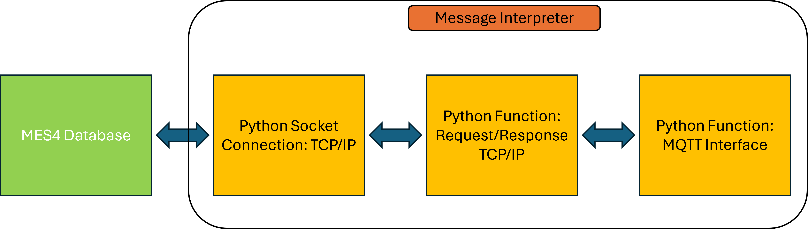
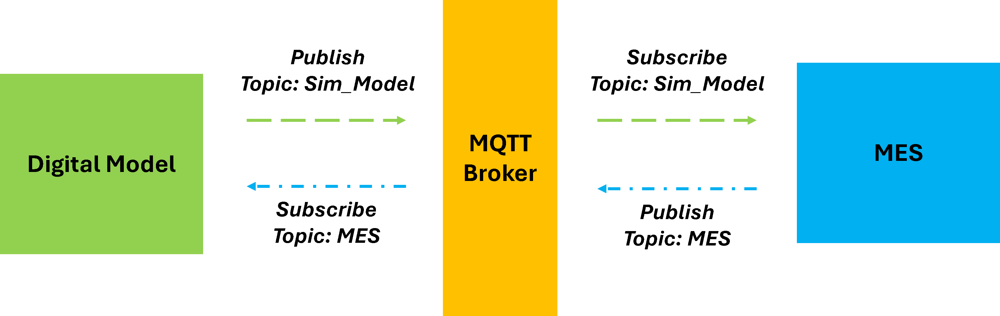
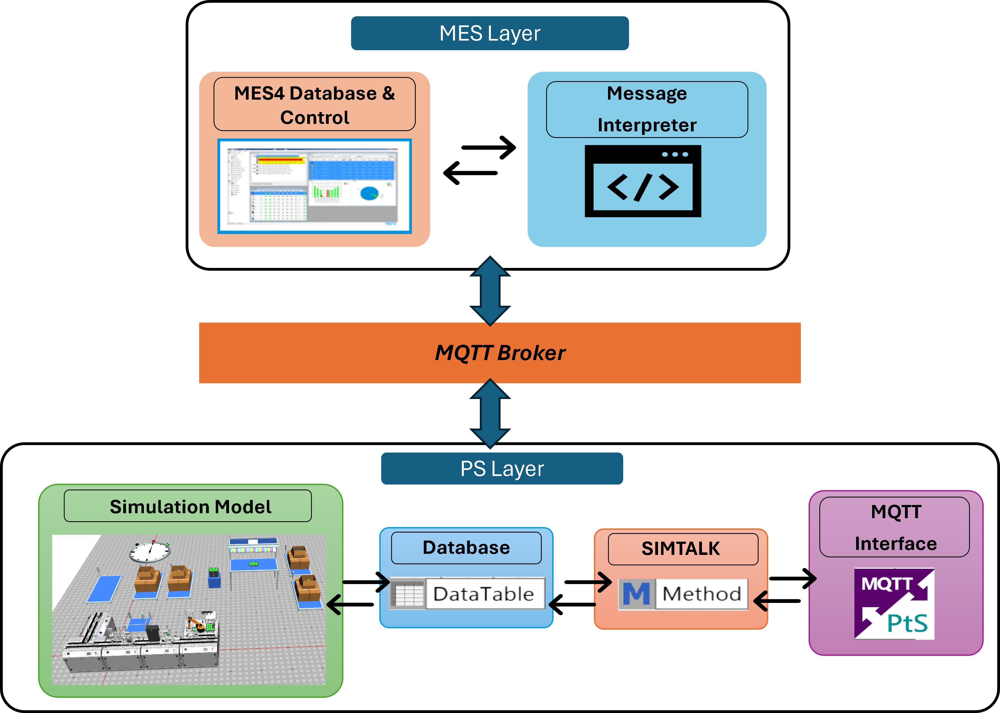

# Phase 2 — Bidirectional Communication Implementation

Phase 2 builds upon the one-way communication established in Phase 1 and introduces bidirectional communication between MES4 and the simulation model. The objective of this phase is to create a closed-loop connection where both the MES4 system and the simulation environment can exchange information and influence each other in real time.

This phase represents the transition from a Digital Shadow toward a Digital Twin architecture.

---

# Phase 2 Architecture

The implementation introduces a bidirectional communication workflow between MES4 and Plant Simulation.

---

# MES Layer Implementation

The MES layer is responsible for:

- Order management
- Resource operation handling
- Status monitoring
- Communication with the simulation environment

---

## TCP/IP Integration

Multiple MES4 service calls are implemented in this phase to support bidirectional communication.

The following MES4 services are used:

| Service | Purpose |
|---|---|
| GetFirstOpForRsc | Retrieve first operation |
| GetOpForONoOPos | Retrieve operation details |
| OpStart | Update operation start |
| OpEnd | Update operation completion |

These services allow the MES layer to:

- Retrieve order information
- Access operation details
- Monitor resource activity
- Update production status

---

## Enhanced Message Interpreter

The Python-based message interpreter developed in Phase 1 is extended to support feedback communication from the simulation model.

The interpreter now performs:

- TCP/IP communication with MES4
- MQTT publishing
- MQTT subscription
- Message decoding
- Service call generation
- Resource status updates

The message interpreter converts simulation feedback into MES-compatible TCP/IP service calls and forwards them back to MES4.

---

# MQTT Communication

MQTT is used as the main communication layer between MES4 and Plant Simulation.

Separate MQTT topics are used for:

- MES → Simulation communication
- Simulation → MES communication

This structure provides:

- Organized communication
- Reduced message conflicts
- Better synchronization handling

---

# Plant Simulation Layer

The Plant Simulation layer is enhanced to support bidirectional communication and real-time updates.

---

## MQTT Interface Enhancements

The MQTT interface inside Plant Simulation now supports:

- Multiple MQTT topics
- Incoming MES messages
- Outgoing simulation feedback
- Resource event updates

SimTalk callback methods are used to process all incoming and outgoing data.

---

## Database Integration

Additional DataTables are introduced inside Plant Simulation to store:

- Order details
- Resource assignments
- Operation information
- Resource states
- Process status updates

These tables allow synchronization between the simulation environment and MES4.

---

# Simulation Model Modifications

The simulation model is updated to behave similarly to a physical manufacturing system.

The modifications include:

- Resource-based event generation
- MQTT-based status publishing
- Dynamic workplan execution
- Real-time process updates
- Resource state monitoring

Each resource inside the simulation can now send event updates back to MES4.

---

# Proof of Concept (POC)

Before connecting to the actual MES4 system, a Proof of Concept (POC) implementation was developed.

Simulation File: [PlantSim File: SL_V08_Phase2_WorkingPOC](../PlantSim_Files/SL_V08_Phase2_WorkingPOC.spp)

The POC included:

- Temporary MES interface
- XML-based process database
- Multiple service call handling
- Bidirectional MQTT communication
- Event-based resource updates

The POC helped validate the closed-loop communication workflow before integrating with the physical MES system.

A working Phase 2 POC video can be viewed by following the link: [Watch Phase 2 Working POC](https://drive.google.com/file/d/1rQ92IdOmbOyu_P9c0fEOFOZZ4dt81IGI/view?usp=sharing)

---

# Final Bidirectional Communication Workflow

The final implementation enables both MES4 and Plant Simulation to exchange information continuously.

## Workflow

The implementation followed a Architecture:

## Realization
With changes established earlier in the implementation POC slight modification was done in the MQTT interface to connect respective topic of MES Layer and the simulation is now controlled dynamically using MES information.

The working video can be viewed by following this link: [Watch Phase 2 Working](https://drive.google.com/file/d/1ibPcnWGAUKdvjAhvx9dDCetnwnF8H0uF/view?usp=sharing)

Simulation File: [PlantSim File: SL_V1_Phase2](../PlantSim_Files/SL_V1_Phase2.spp)

---

# Software/Tools Used

| Software/Tools | Purpose |
|---|---|
| Siemens Plant Simulation | Simulation Environment |
| SimTalk | Simulation Logic |
| Python | Communication Interface |
| MQTT | Bidirectional Data Transfer |
| TCP/IP | MES Communication |
| MES4 | Manufacturing Execution System |
| DataTable | Simulation Database |

---

# Purpose of Phase 2

Phase 2 establishes the foundation for:

- Digital Twin development
- Closed-loop MES interaction
- Real-time synchronization
- Plant-level system validation
- Event-driven simulation
- Virtual Acceptance Testing (VAT)