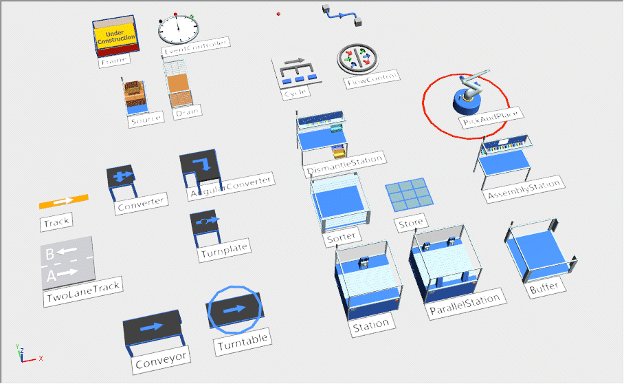
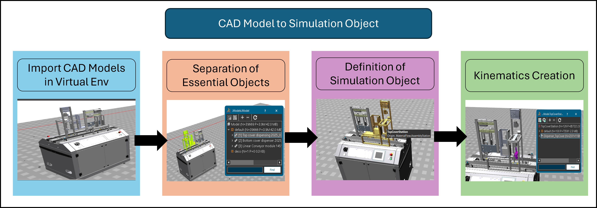
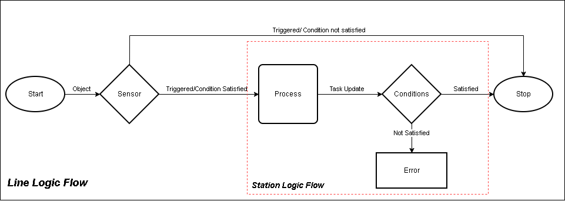
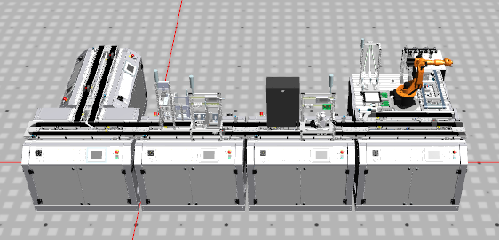
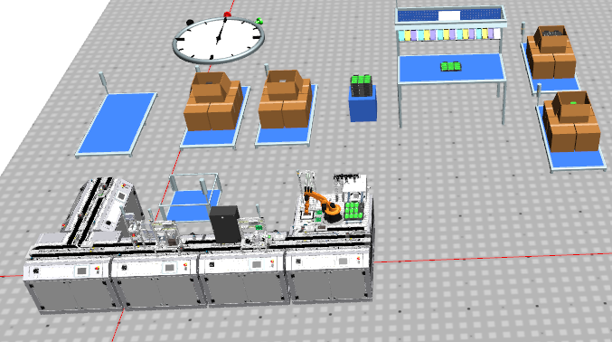

# Simulation Model Setup

This section explains the development of the simulation model for the AAU FESTO Assembly Line using **Siemens Tecnomatix Plant Simulation (PS)**.

The goal of the simulation is to create a virtual representation of the physical assembly line that behaves similarly to the real manufacturing process. The simulation model serves as the foundation for future integration with MES and Digital Twin development.

---

# Objective

The main objective of the simulation setup is to:

- Develop a reliable simulation model of the FESTO assembly line
- Replicate the real manufacturing workflow
- Create reusable simulation logic
- Validate assembly operations in a virtual environment
- Prepare the model for future MES integration

---

# Requirements & Considerations

The simulation model is developed based on several requirements and assumptions.

## Considerations

### C1 — Focus of Implementation

The simulation focuses on the **AAU SmartLab FESTO Assembly Line**.

---

### C2 — Level of Detail

The simulation model is designed to closely match the real assembly line while keeping the CAD models lightweight enough for simulation performance.

Only important CAD objects involved in the process are used.

| Real-Time Component | Simulation Object |
|---|---|
| Conveyors | Tracks |
| Bottom Cover Station | Station |
| Drilling Station | Station |
| RFID Sensors | Sensors |
| Robot Cell | Robot + Assembly Station |
| PCB Slot & Conveyor | Multiple Stations |
| Cover Magazines | Buffer |
| Fuses / PCB / Covers | Source |

---

### C3 — Simulation Workflow Scope

The simulation only includes the components required for the assembly workflow and digital twin scope.

---

### C4 — Processing Time

Default station timings are initially used and can later be adjusted to match real production conditions.

---

### C5 — Simplifications

To simplify the first simulation model:

- No machine breakdowns
- Constant processing times
- Infinite material supply

are assumed.

---

### C6 — Simulation Logic

Custom simulation behavior is developed using **SimTalk**, a PS native programming language.

---

### C7 — CAD Format

All CAD models are imported in **STEP format**.

---

# Requirements

| ID | Description |
|---|---|
| R1 | Simulation should behave similar to the real assembly line |
| R2 | Include 3 process stations and 1 robot cell |
| R3 | Support future product customization |
| R4 | Support stable repeated simulations |

---

# Simulation Workflow

The simulation follows the FESTO assembly process shown below.

## Workflow Steps

### 1. Initial Preparation

- Pallets are prepared
- Bottom covers and top covers are loaded
- PCBs are loaded into the robot cell
- Fuses are loaded into the dispenser

---

### 2. Assembly Process

1. A pallet enters the conveyor system
2. Bottom cover is placed onto the pallet
3. Drilling operation is performed
4. Pallet moves to the robot cell
5. Robot checks drilled holes
6. PCB is assembled onto the bottom cover
7. Fuses are placed on the PCB
8. Product is returned to the pallet
9. Quality inspection is performed
10. Top cover is assembled
11. Finished product exits the line

---

# Preparation & Setup

Building the simulation completely from scratch is time-consuming. Since the physical assembly line already exists, existing CAD models are reused. Highly detailed CAD models can reduce simulation performance, so unnecessary details are removed while preserving the required simulation functionality.

---

# Model Layout Preparation

The simulation layout is created directly from the existing assembly line structure.

## CAD Conversion Process

The following process is used to convert CAD models into simulation objects:

---

# Simulation Logic

The simulation logic is developed using **SimTalk**.

The logic controls:

- Sensor interactions
- Material flow
- Station behavior
- Robot operations
- Process execution

---

# Standard Logic Flow

---

# Final Simulation Model

Simulation File: [PlantSim File: SL_V05_SimModel](../PlantSim_Files/SL_V05_SimModel.spp)

After implementing:

- CAD layout
- Material flow
- Simulation objects
- SimTalk logic

the simulation model becomes fully operational and capable of replicating the FESTO assembly process in a virtual environment.The current model satisfies all initial requirements except product customization, which will be implemented in future development phases.

The working simulation model can be viewed by following the link: 

[Watch the FESTO Assembly line Simulation](https://drive.google.com/file/d/1-ep4rJ5mM6YytkQfNpcW81KHtPe7f6Sf/view?usp=sharing)

---
